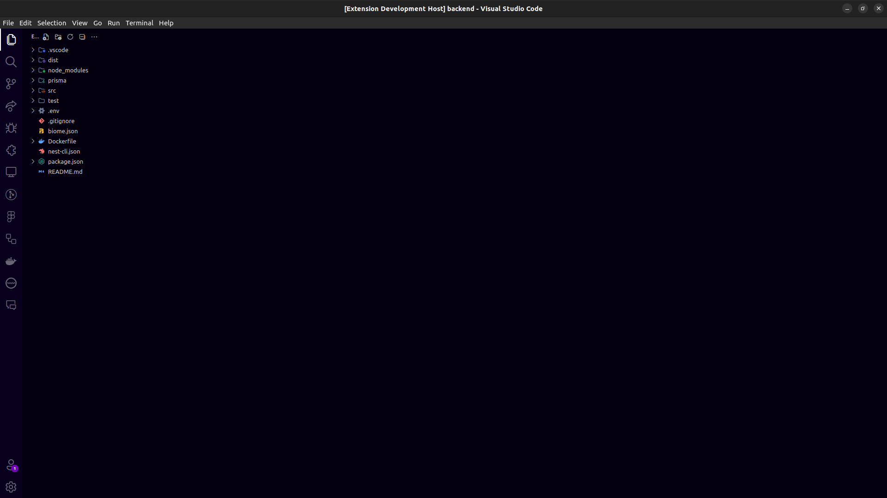

# Anime Code Theme 🎨

Um tema dark para Visual Studio Code inspirado em cores de anime, com paleta pastel confortável para longas sessões de desenvolvimento.

## Preview

## Características ✨

- 🎨 Paleta de cores pastel inspirada em anime
- 💜 Tons suaves de roxo, rosa, azul e pêssego
- 👁️ Baixo contraste para reduzir fadiga visual
- ⏱️ Confortável para longas sessões de código
- 🌙 Background dark suave (#1a1625)

## Instalação

1. Abra o VS Code
2. Vá para Extensions (`Ctrl+Shift+X` / `Cmd+Shift+X`)
3. Pesquise por "Anime Code Theme"
4. Clique em Install
5. Ative em `File > Preferences > Color Theme > Anime Code`

## Paleta de Cores

- **Background**: `#1a1625`
- **Foreground**: `#d4c5e0`
- **Keywords**: `#e891e8` (Rosa/Magenta)
- **Functions**: `#a89dd8` (Lavanda)
- **Strings**: `#d8b4a0` (Pêssego)
- **Classes**: `#9dadd8` (Azul suave)
- **Comments**: `#7a6d8f` (Roxo acinzentado)

## Contribuindo

Sugestões e issues são bem-vindas! Sinta-se livre para abrir uma [issue](https://github.com/ViniciusDev26/Anime-Code/issues) ou pull request.

## Autor

**Carlos Vinicius** ([ViniciusDev26](https://github.com/ViniciusDev26))
- Email: viniciusdev.26@gmail.com

## Licença

MIT License - veja o arquivo [LICENSE](LICENSE) para mais detalhes.
